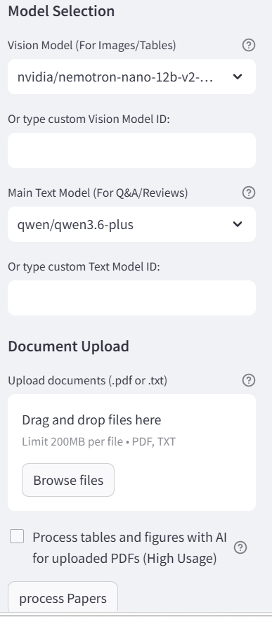
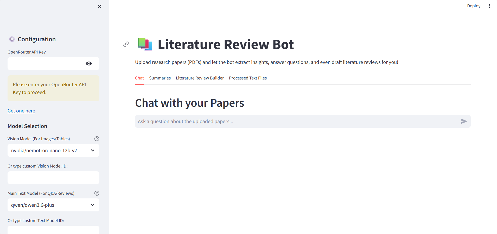

# Literature Review Bot (Early Release)

This is an early release of Literature Review Bot for Windows.

It helps you:
- process PDF and TXT papers
- ask questions about your papers
- generate paper summaries
- generate a cross-paper literature review
- retain processed text in the app session

## How to Run and Use

### 1. What you need

1. Windows
2. Internet connection
3. OpenRouter API key
4. The project source files in one folder.

### 2. How to run the app

1. Open a PowerShell window in the project folder.
2. Start the app with:
   - `python -m streamlit run app.py`
3. If Windows asks about network access, click Allow.
4. Your browser should open the app.
5. If browser does not open, manually go to:
   - http://localhost:8501

### 3. Get your OpenRouter API key

1. Go to https://openrouter.ai/keys
2. Sign in or create an account.
3. Create a new API key.
4. Copy the key.
5. In the app sidebar, paste it into OpenRouter API Key.

### 4. Quick start in the app

1. In sidebar, select models (or keep defaults).
2. Upload files in Document Upload:
   - supported: PDF, TXT
3. PDFs are processed automatically with local Marker in CPU-only mode.
4. Click process Papers.
5. Use tabs in the main area:
   - Chat
   - Summaries
   - Literature Review Builder

### 5. UI guide

#### Screenshot 1: Sidebar Configuration and Upload

This screenshot shows where to:
- enter API key
- choose the text model
- upload documents
- upload documents for processing
- click process Papers

#### Screenshot 2: Main Tabs and Chat Area

This screenshot shows where to:
- switch between tabs
- ask questions in Chat
- generate summaries and literature reviews

### 6. What each tab does

#### Chat
- Ask questions about your uploaded papers.
- You can scope retrieval to one paper or all papers.

#### Summaries
- Pick one paper and generate a structured summary.

#### Literature Review Builder
- Generate a combined review across uploaded papers.
- Choose short or long output.
- Optionally include figure/table mentions.

### 7. Marker PDF extraction

Marker is the app's automatic local PDF processor. It produces Markdown with
LaTeX equations, formatted tables, and extracted images.

1. Install the project dependencies, including Marker:
   - `python -m pip install -r requirements.txt`
   - Or only Marker: `python -m pip install marker-pdf`
2. Verify the CLI:
   - `marker_single --help`
3. Start the app:
   - `python -m streamlit run app.py`
4. Upload a PDF and click **process Papers**. Marker is selected automatically.

Marker mode uses `fast` mode and disables multiprocessing to reduce CPU/RAM usage. Marker itself does not use OpenRouter during parsing; when an OpenRouter key is provided, the app uses the selected image-caption model to describe extracted paper images and adds those descriptions to the searchable paper text. Original images and `.txt` sidecars containing nearby extracted text and captions are stored under `extracted_visuals/<paper>/`.

For difficult scanned or math-heavy PDFs, Marker supports higher-accuracy modes and optional LLM correction, but those require more local resources or API usage and are intentionally not enabled by this integration.

The current `requirements.txt` is the Marker profile. MinerU is not part of this application.

## Disclaimer (Early Release)

This is an early release.

Please read these points before using the app.

## 1. Early release status

1. This version is not perfect.
2. Some bugs and rough edges may exist.
3. Results may change as the app is updated.

## 2. AI output quality

1. AI answers can be wrong, incomplete, or biased.
2. Always verify important claims with original papers.
3. Do not treat generated text as final truth.

## 3. API usage and cost

1. You use your own OpenRouter API key.
2. Your account may be charged based on your OpenRouter plan.
3. Vision processing can increase usage and cost.

## 4. Privacy and data handling

1. Do not upload sensitive or regulated data unless allowed by your policy.
2. Keep your API key private.
3. Use trusted devices and networks.

## 5. Availability and support

1. This release is provided as-is.
2. No uptime or compatibility guarantee is provided.
3. Feature behavior can change in future releases.

## 6. Responsible use

1. Use this tool only for legal and ethical work.
2. Follow copyright and data-use rules for all uploaded papers.
3. You are responsible for your usage and outputs.
